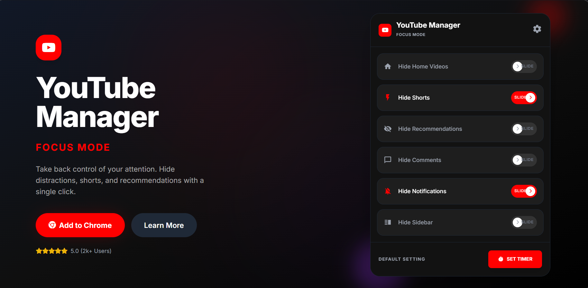

# FocusTube & FocusX - Distraction Free
Algorithms want your time. This extension gives it back. Reclaim hours of your day and stay focused on YouTube and X (Twitter).

## Demo Video

## What It Does
- **Dual Modes:** Toggle instantly between YouTube and X (Twitter) focus managers
- **FocusTube:** Hide YouTube homepage, Shorts, recommendations, comments, and sidebars
- **FocusX Timers:** Set specific "Surf Time" limits and "Block Time" cooldowns on X
- **Custom Whitelists:** Keep DMs or Search open on X while blocking the main timeline
- **Real-time Blocking:** Immediately locks you out with a clean landing page when time's up

## Installation
1. just download the repo zip and keeo the rest of the process same
2. Open Chrome → `chrome://extensions/`
3. Flip the **Developer mode** switch (top-right corner)
4. Click **Load unpacked** → select the folder
5. Boom. You're in control. *(Warning: for first time use reload the page before you use)*

## What's Next?
This is version 2.0. More focus features coming soon because your attention is your most valuable asset.

---

## ☕ Support the Creator

If you find this extension useful, consider supporting us!  
Your contribution will help us publish this extension on the Chrome Web Store.

 [Buy Me a Coffee](https://buymeacoffee.com/ashirwad05)

**Pro tip:** Combine with website blockers during deep work. Your productivity will skyrocket. 🚀

## License
MIT License - Free to use and modify

---

*Note: This extension is for personal productivity. Use responsibly and in accordance with YouTube's terms of service.*